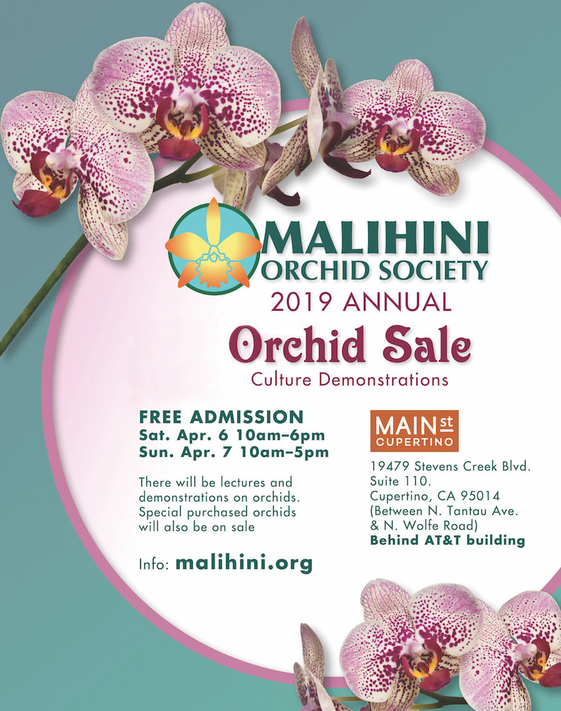

MALIHINI ORCHID SOCIETY 2019 Annual Orchid Sale 
Culture Demonstrations 
FREE ADMISSION 
Sat. Apr. 06 10am-6pm 
Sun. Apr. 07 10am-5pm

19479 Stevens Creek Blvd. Suite 110 
Cupertino, CA  95014

This address will lead you to AT&T on Stevens Creek Blvd.  Our room is connected directly behind AT&T in the Main Street Cupertino shopping complex.    SEE MAP on [mainstreetcupertino.com](http://mainstreetcupertino.com/directory/)

There will be FREE lectures and demonstrations on orchids.
Special purchased orchids from Taiwan will also be on sale.
This includes Chinese Cymbidiums, Cattleya hybrids and Phalaenopsis species.

The FREE demos will be at TOWN SQUARE (the lawn area between Philz Coffee & Panino Giusto).  If there is rain, the demos will be next to our salesroom, suite 110 (directly behind AT&T store).  SEE MAP at [mainstreetcupertino.com](http://mainstreetcupertino.com/directory/)

The following vendors are participating in our sale:

* Orchid Design (indoor & outdoor growing orchids)
* PaphParadise (Paphiopedilum & Phragmipedium, and more) – also known as Lady Slippers
* Asbell’s Orchids (outdoor growing orchids)
* Member Sales (plants from our members)
* Special ordered Chinese Cymbidiums from Asia & more

Info @ malihini.org
mainstreetcupertino.com

